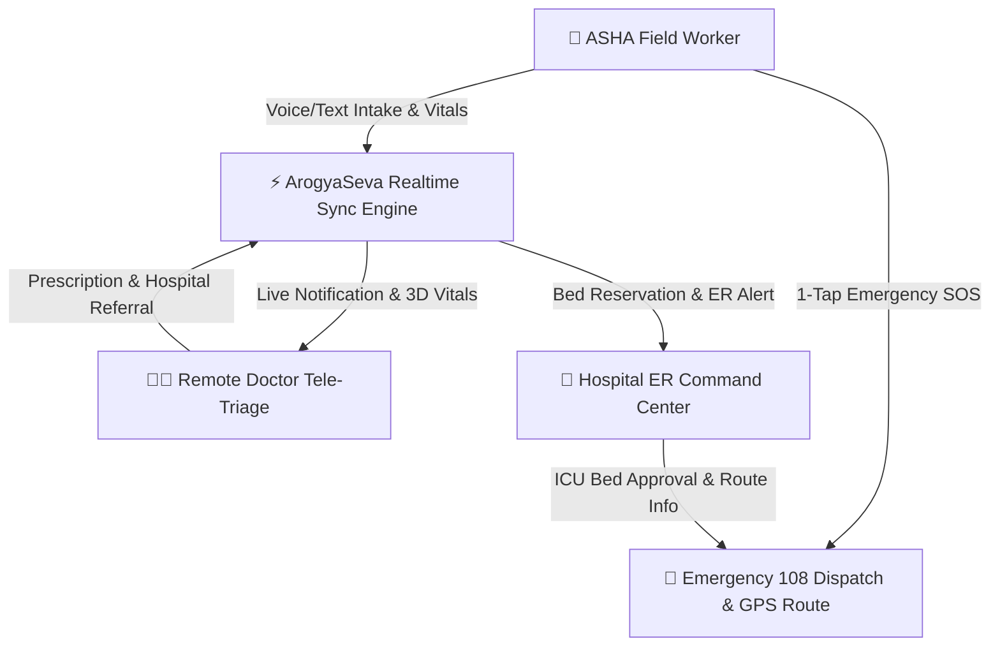

# 🏥 AROGYA SEVA v3.2 — Rural Healthcare Platform

[](https://react.dev/)
[](https://www.typescriptlang.org/)
[](https://vite.dev/)
[](https://tailwindcss.com/)
[](https://supabase.com/)
[](#-responsive--cross-device-compatibility)

**ArogyaSeva** is an advanced, production-ready rural healthcare tele-triage, emergency response, and hospital ER bed management platform. Designed specifically to bridge critical healthcare gaps in remote villages and rural sub-centers, ArogyaSeva empowers **ASHA Community Health Workers (CHWs)**, **Remote Tele-Doctors**, and **Hospital ER Staff** with real-time sync, offline intake capabilities, and live GPS emergency navigation.

---

## 🌟 Key Features & Ecosystem Portals



### 👩‍⚕️ 1. ASHA Community Health Worker (CHW) Portal (`/chw`)
- **Voice & Text Intake**: Instant AI-assisted clinical intake using speech-to-text or structured symptom entry.
- **Offline First**: Full offline queue storage — intake records are queued locally and automatically sync when connectivity restores.
- **Vitals Calculation**: Real-time evaluation of SpO2, Blood Pressure, Heart Rate, Temperature, and Respiratory Rate with urgency warnings.
- **Regional Jurisdiction**: Seamless state & district selection (Maharashtra, Karnataka, Uttar Pradesh, Bihar, etc.).

### 👨‍⚕️ 2. Doctor Tele-Triage Desk (`/doctor`)
- **Live Queue & Urgency Sorting**: Real-time incoming case queue sorted by critical urgency levels.
- **3D Vitals Visualizer**: Interactive 3D pulse & vitals rendering powered by Three.js.
- **Instant Response & Prescriptions**: Transmit diagnostic notes, treatment protocols, and STAT prescriptions directly back to the field CHW device.
- **Hospital Referral Authorization**: One-click authorization for emergency bed reservations at regional district hospitals.

### 🏥 3. Hospital ER & ICU Bed Command (`/hospital`)
- **Realtime ICU Bed Availability**: Live tracking of available ICU beds, trauma bays, and emergency staff.
- **Intake Approval & Bed Assignment**: Approve incoming CHW/Doctor referrals and assign specific bed numbers (e.g. `ICU-04`, `Trauma Bay 02`).
- **GPS Ambulance Navigation**: Calculate turn-by-turn routing between patient location and target hospital facilities using Leaflet GIS mapping.

### 🚨 4. Emergency SOS Response Mode (`/emergency`)
- **One-Tap 108 Dispatch**: Instant escalation for severe hypoxia (SpO2 < 90%), cardiac symptoms, or extreme trauma.
- **High-Contrast Red Interface**: High-legibility UI designed for rapid emergency operation under high-stress field conditions.

### ⚙️ 5. Admin Infrastructure & Live Telemetry (`/admin`)
- **System Health Monitoring**: Realtime node latency, sync queue depth, and active role switcher.
- **Multi-Role Physical Testing**: Switch seamlessly between CHW, Doctor, Hospital Staff, and Admin roles to test real-time multi-device synchronization.

---

## 🎨 Design System & Visual Identity

- **Palette**: Clean Medical Red (`#DC2626`), Charcoal Slate (`#0F172A`), and Crisp White (`#FFFFFF`).
- **Typography**: Modern font stack utilizing **Plus Jakarta Sans** and **Inter**.
- **Contrast**: High WCAG AA/AAA contrast ratios for outdoor sunlight readability on field mobile devices.

---

## 📱 Responsive & Cross-Device Compatibility

ArogyaSeva is engineered to be **100% responsive and adaptable** across all screen sizes:
- 📱 **Smartphones** (320px, 375px, 390px, 430px — iPhone SE to Pro Max / Android) with touch drawer navigation and touch target padding (`min-h-[44px]`).
- 📱 **Tablets & iPads** (768px – 1024px) with adaptive grid columns and smooth scrollbar-less touch tab navigation.
- 💻 **Laptops & Desktops** (1280px – 1920px+) with multi-column split views and full GIS map canvas support.
- 📺 **4K Ultra-Wide Monitors** (2560px+) with max-width containment safeguards.

---

## 🚀 Technology Stack

- **Core Framework**: [React 19](https://react.dev/) + [TypeScript 5](https://www.typescriptlang.org/)
- **Bundler & Dev Server**: [Vite v8](https://vite.dev/)
- **Styling**: [Tailwind CSS v4](https://tailwindcss.com/)
- **State & Realtime**: React Context + [Supabase Realtime](https://supabase.com/) & WebSockets
- **Icons**: [Lucide React](https://lucide.react.dev/)
- **GIS Mapping**: [Leaflet](https://leafletjs.com/) & [React-Leaflet](https://react-leaflet.js.org/)
- **3D Graphics**: [Three.js](https://threejs.org/)
- **Animations**: [Framer Motion](https://www.framer.com/motion/)

---

## 🛠️ Getting Started

### Prerequisites
- Node.js (v18.0.0 or higher recommended)
- npm or yarn

### Installation & Setup

1. **Clone the repository**:
   ```bash
   git clone https://github.com/garvshaw89-glitch/arogyaseva-v3.2.git
   cd arogyaseva-v3.2
   ```

2. **Install dependencies**:
   ```bash
   npm install
   ```

3. **Start the development server**:
   ```bash
   npm run dev
   ```
   Access the app locally at `http://localhost:3004/` or across your network at `http://<your-local-ip>:3004/`.

4. **Build for Production**:
   ```bash
   npm run build
   ```

---

## 🔄 Automatic GitHub Push Service

This repository includes a built-in auto-push watcher service (`auto-push.mjs`). Whenever you edit and save any project files while running `npm run dev`, your changes are automatically staged, committed, and pushed to GitHub!

- **To run auto-push standalone**:
  ```bash
  npm run auto-push
  ```

---

## 📄 License

This project is open-source and built for healthcare accessibility innovation.

---

<p center align="center">
  <b>ArogyaSeva v3.2</b> — Empowering Rural Healthcare with Realtime Tele-Triage & Emergency Bed Command.
</p>
