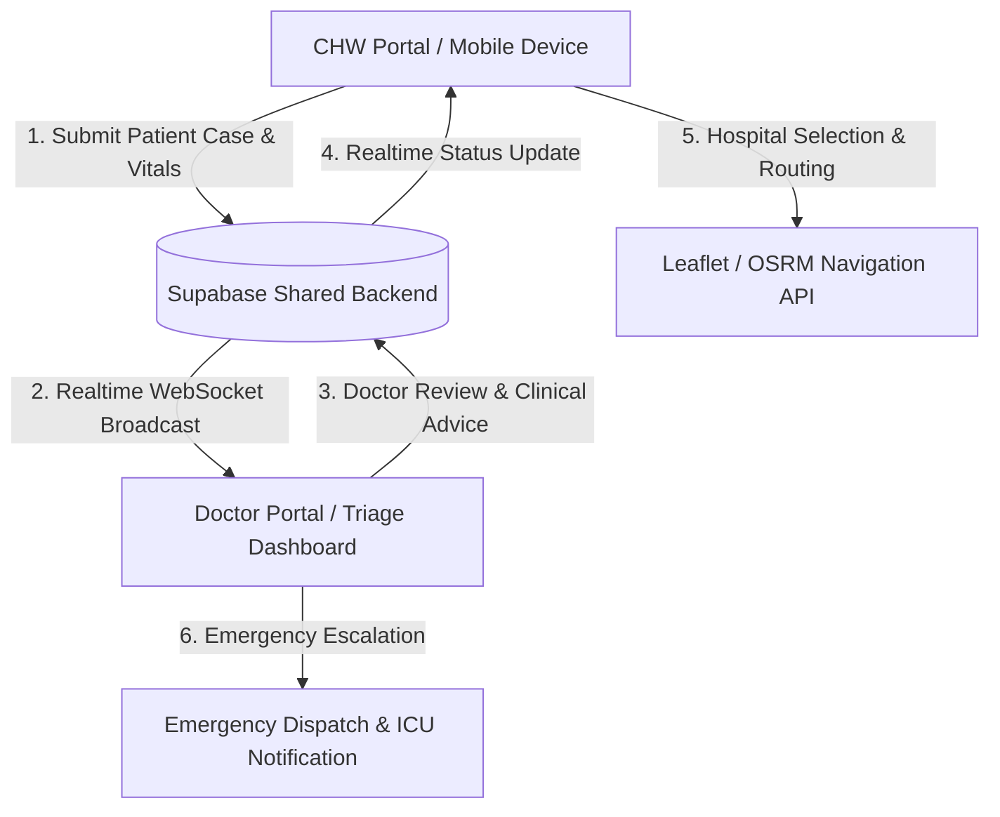

# Implementation Plan - AROGYASEVA: Connected Rural Healthcare & Referral Platform

Build a production-ready, high-end full-stack healthcare coordination platform (**AROGYASEVA**) serving Community Health Workers (CHWs) in rural areas, hospital doctors, and emergency response teams. The system connects CHWs and Doctors via a shared real-time database and features live maps, hospital discovery, navigation, clinical intake with voice/AI triage assistance, and emergency escalation.

---

## User Review Required

> [!IMPORTANT]
> **Key Architecture Highlights**:
> 1. **Shared Supabase Backend**: Single PostgreSQL database + Supabase Auth + Supabase Realtime Channels for instant multi-device / multi-portal synchronization.
> 2. **Built-in Offline-First Sync Layer**: Automatic IndexedDB/localStorage queuing when network is unavailable, with background sync upon reconnect (`● LIVE`, `● SYNCING`, `● OFFLINE`).
> 3. **Dual Main Portals & Demo Role Switcher**: `/chw` for field health workers, `/doctor` for hospital triage doctors, `/` for landing ecosystem overview, `/admin` for audit logs and facility management. A top bar role switcher allows testing multi-device real-time sync in side-by-side tabs.
> 4. **Live Maps & Route Navigation**: OpenStreetMap + Leaflet rendering with live browser Geolocation API, nearby healthcare search (OSM Overpass / local facility index), route calculation (OSRM routing), step-by-step turn directions, and external handoff to Google Maps/Waze.
> 5. **Clinical Voice-to-Text & AI Triage**: Voice recording with SpeechRecognition API, vitals anomaly warning system, and automated clinical case synthesis for rapid doctor review.

---

## Architecture & Data Flow

---

## Database Schema (Supabase / PostgreSQL)

1. **`users` / `profiles`**: `id`, `email`, `role` (`chw`, `doctor`, `admin`), `full_name`, `phone`, `avatar_url`, `created_at`
2. **`chw_profiles`**: `id`, `user_id`, `assigned_village`, `sub_center_name`, `district`, `state`, `active_status`
3. **`doctor_profiles`**: `id`, `user_id`, `hospital_id`, `specialization`, `qualification`, `availability_status` (`online`, `busy`, `offline`)
4. **`patients`**: `id`, `chw_id`, `name`, `age`, `gender`, `phone`, `address`, `village`, `emergency_contact_name`, `emergency_contact_phone`, `created_at`
5. **`clinical_cases`**: `id`, `patient_id`, `chw_id`, `assigned_doctor_id`, `status` (`NEW`, `UNDER_REVIEW`, `DOCTOR_RESPONDED`, `REFERRAL_REQUIRED`, `EMERGENCY`, `IN_TRANSIT`, `AT_HOSPITAL`, `COMPLETED`), `urgency` (`LOW`, `MODERATE`, `URGENT`, `CRITICAL`), `chief_complaint`, `symptoms_json`, `vitals_json` (BP, HR, SpO2, Temp, RespRate, Weight), `voice_note_transcript`, `ai_summary`, `created_at`, `updated_at`
6. **`doctor_responses`**: `id`, `case_id`, `doctor_id`, `diagnosis_notes`, `recommended_action`, `medications_prescribed`, `referral_needed`, `target_hospital_id`, `created_at`
7. **`referrals`**: `id`, `case_id`, `chw_id`, `doctor_id`, `hospital_id`, `urgency_level`, `reason`, `status`, `transit_vehicle_type`, `created_at`, `updated_at`
8. **`hospitals`**: `id`, `name`, `type` (`Primary Health Center`, `Community Health Center`, `District Hospital`, `Tertiary Care / Medical College`), `latitude`, `longitude`, `address`, `phone`, `icu_beds_available`, `oxygen_available`, `emergency_24x7`
9. **`notifications`**: `id`, `user_id`, `title`, `message`, `type`, `read`, `case_id`, `created_at`
10. **`messages`**: `id`, `case_id`, `sender_id`, `receiver_id`, `content`, `created_at`

---

## Proposed Technical Stack

- **Frontend Framework**: React 18 + Vite + TypeScript
- **Styling**: Tailwind CSS + Custom CSS Design Tokens (Glassmorphism, Neon/Medical accents, Dark/Light modes)
- **Routing**: React Router v6
- **Realtime & Backend**: Supabase JS Client (`@supabase/supabase-array` / `@supabase/supabase-js`) + Fallback BroadcastChannel/IndexedDB Real-Time Sync Provider
- **State & Storage**: React Context + Custom Realtime Hooks + LocalForage / IndexedDB for offline queue
- **3D Visualizations**: Three.js WebGL canvas (Interactive 3D Health Globe & Pulse Heart Rate Visualizer)
- **Maps & Directions**: Leaflet.js / React-Leaflet + OpenStreetMap tiles + OSRM Route Engine API
- **Icons & Motion**: Lucide React + Framer Motion
- **AI & Speech**: Web Speech Recognition API + Clinical Triage Rules Engine / Gemini AI client

---

## Proposed Changes

### Core Ecosystem Structure

#### [NEW] [package.json](file:///c:/Users/garvs/.gemini/antigravity-ide/brain/02db06de-6db4-4fc0-903b-f32bfd12cb2a/antigravity/package.json)
Configure Vite project dependencies including `@supabase/supabase-js`, `leaflet`, `react-leaflet`, `three`, `@react-three/fiber`, `@react-three/drei`, `lucide-react`, `framer-motion`, `localforage`, `canvas-confetti`.

#### [NEW] [vite.config.ts](file:///c:/Users/garvs/.gemini/antigravity-ide/brain/02db06de-6db4-4fc0-903b-f32bfd12cb2a/antigravity/vite.config.ts)
Vite configuration with alias support, PWA assets support, and dev server port config.

#### [NEW] [index.html](file:///c:/Users/garvs/.gemini/antigravity-ide/brain/02db06de-6db4-4fc0-903b-f32bfd12cb2a/antigravity/index.html)
Root HTML file with Google Fonts (Plus Jakarta Sans & Inter) and Leaflet CSS stylesheets.

#### [NEW] [src/index.css](file:///c:/Users/garvs/.gemini/antigravity-ide/brain/02db06de-6db4-4fc0-903b-f32bfd12cb2a/antigravity/src/index.css)
Tailwind base imports, glassmorphism card styles, pulse animations, emergency highlight effects, and custom scrollbars.

---

### Backend & Service Layer (`src/services/` & `src/context/`)

#### [NEW] [src/lib/supabase.ts](file:///c:/Users/garvs/.gemini/antigravity-ide/brain/02db06de-6db4-4fc0-903b-f32bfd12cb2a/antigravity/src/lib/supabase.ts)
Supabase client initialization using `VITE_SUPABASE_URL` and `VITE_SUPABASE_ANON_KEY`.

#### [NEW] [src/services/realtimeService.ts](file:///c:/Users/garvs/.gemini/antigravity-ide/brain/02db06de-6db4-4fc0-903b-f32bfd12cb2a/antigravity/src/services/realtimeService.ts)
Unified Real-time Synchronization Manager handling Supabase Postgres Changes subscriptions (`clinical_cases`, `doctor_responses`, `referrals`, `notifications`, `messages`), fallback multi-tab `BroadcastChannel` events, and IndexedDB sync queue.

#### [NEW] [src/services/offlineSyncService.ts](file:///c:/Users/garvs/.gemini/antigravity-ide/brain/02db06de-6db4-4fc0-903b-f32bfd12cb2a/antigravity/src/services/offlineSyncService.ts)
Offline queue for CHW intake when internet connection drops. Automatically detects online status, queues pending cases in IndexedDB, and auto-flushes records to Supabase upon reconnection.

#### [NEW] [src/services/locationService.ts](file:///c:/Users/garvs/.gemini/antigravity-ide/brain/02db06de-6db4-4fc0-903b-f32bfd12cb2a/antigravity/src/services/locationService.ts)
Geolocation wrapper providing real position coordinates, accuracy circle, error handling (denied, unavailable, timeout), distance calculations (Haversine formula), and fallback default village/center coordinates.

#### [NEW] [src/services/hospitalService.ts](file:///c:/Users/garvs/.gemini/antigravity-ide/brain/02db06de-6db4-4fc0-903b-f32bfd12cb2a/antigravity/src/services/hospitalService.ts)
Hospital and healthcare facility query service integrating OSM Overpass API to fetch real hospitals around user location, along with verified Regional Health Centers database.

#### [NEW] [src/services/routingService.ts](file:///c:/Users/garvs/.gemini/antigravity-ide/brain/02db06de-6db4-4fc0-903b-f32bfd12cb2a/antigravity/src/services/routingService.ts)
OSRM Routing API integration calculating turn-by-turn routes between patient/CHW coordinates and selected hospital, returning route polyline, total distance (km), estimated travel time (min), and external navigation links (Google Maps / Waze).

#### [NEW] [src/services/aiTriageService.ts](file:///c:/Users/garvs/.gemini/antigravity-ide/brain/02db06de-6db4-4fc0-903b-f32bfd12cb2a/antigravity/src/services/aiTriageService.ts)
Clinical Intake AI Assistant converting clinical voice transcripts & symptoms into structured summaries, flagging vital sign red flags (hypoxia, severe hypertension, high fever), and estimating clinical urgency level without replacing doctor judgment.

#### [NEW] [src/context/AuthContext.tsx](file:///c:/Users/garvs/.gemini/antigravity-ide/brain/02db06de-6db4-4fc0-903b-f32bfd12cb2a/antigravity/src/context/AuthContext.tsx)
Authentication Provider providing Supabase Auth session, profile details, active role, and instant demo role switching (`CHW`, `Doctor`, `Admin`).

#### [NEW] [src/context/DataContext.tsx](file:///c:/Users/garvs/.gemini/antigravity-ide/brain/02db06de-6db4-4fc0-903b-f32bfd12cb2a/antigravity/src/context/DataContext.tsx)
Central Data Store managing Patients, Clinical Cases, Doctor Responses, Referrals, Notifications, Hospitals, Connection Status (`● LIVE`, `● SYNCING`, `● OFFLINE`), and pending offline sync item count.

---

### UI Components (`src/components/`)

#### [NEW] [src/components/common/Header.tsx](file:///c:/Users/garvs/.gemini/antigravity-ide/brain/02db06de-6db4-4fc0-903b-f32bfd12cb2a/antigravity/src/components/common/Header.tsx)
Top navigation bar featuring ecosystem branding, live network indicator (`LIVE / SYNCING / OFFLINE`), real-time notification drawer with unread counter, audio alert toggle, demo role switcher, and user avatar.

#### [NEW] [src/components/3d/HealthGlobe.tsx](file:///c:/Users/garvs/.gemini/antigravity-ide/brain/02db06de-6db4-4fc0-903b-f32bfd12cb2a/antigravity/src/components/3d/HealthGlobe.tsx)
Three.js canvas rendering a futuristic glowing 3D Earth Globe with pulsing node markers connecting rural health centers to super-specialty hospitals.

#### [NEW] [src/components/3d/PulseVitalsCanvas.tsx](file:///c:/Users/garvs/.gemini/antigravity-ide/brain/02db06de-6db4-4fc0-903b-f32bfd12cb2a/antigravity/src/components/3d/PulseVitalsCanvas.tsx)
Interactive 3D Heart / ECG wave monitor visualization for high-risk and emergency clinical cases.

#### [NEW] [src/components/map/LiveMap.tsx](file:///c:/Users/garvs/.gemini/antigravity-ide/brain/02db06de-6db4-4fc0-903b-f32bfd12cb2a/antigravity/src/components/map/LiveMap.tsx)
Interactive Leaflet Map rendering live user position marker, hospital pins with popup details, calculated route polyline, recenter control, and map layer switcher.

#### [NEW] [src/components/map/HospitalCard.tsx](file:///c:/Users/garvs/.gemini/antigravity-ide/brain/02db06de-6db4-4fc0-903b-f32bfd12cb2a/antigravity/src/components/map/HospitalCard.tsx)
Card component showing hospital details (beds, distance, phone, ICU/oxygen status, "Get Directions", "Start Referral", "Call Hospital").

#### [NEW] [src/components/intake/VoiceIntakeButton.tsx](file:///c:/Users/garvs/.gemini/antigravity-ide/brain/02db06de-6db4-4fc0-903b-f32bfd12cb2a/antigravity/src/components/intake/VoiceIntakeButton.tsx)
Microphone button triggering Speech-to-Text transcription with real-time speech wave animation and clinical field populator.

---

### Portals & Pages (`src/pages/`)

#### [NEW] [src/pages/LandingPage.tsx](file:///c:/Users/garvs/.gemini/antigravity-ide/brain/02db06de-6db4-4fc0-903b-f32bfd12cb2a/antigravity/src/pages/LandingPage.tsx)
Landing Website featuring Hero section with 3D Globe, Problem statement, ArogyaSeva Solution architecture, Live CHW ↔ Backend ↔ Doctor workflow animation, AI Clinical Intelligence preview, Emergency response module, Impact statistics, and CTA buttons to launchers.

#### [NEW] [src/pages/CHWPortal.tsx](file:///c:/Users/garvs/.gemini/antigravity-ide/brain/02db06de-6db4-4fc0-903b-f32bfd12cb2a/antigravity/src/pages/CHWPortal.tsx)
CHW Dashboard featuring Overview metric cards, Clinical Intake Form, Patient Registry, Active Cases timeline, Emergency Escalation trigger, Live Hospital Map & Routing view, Offline Sync status banner, and Doctor Feedback viewer.

#### [NEW] [src/pages/DoctorPortal.tsx](file:///c:/Users/garvs/.gemini/antigravity-ide/brain/02db06de-6db4-4fc0-903b-f32bfd12cb2a/antigravity/src/pages/DoctorPortal.tsx)
Doctor Triage Portal featuring Live Case Queue with instant audio notification, Emergency Priority Banner, Multi-pane Case Review (Vitals analysis, AI summary, Voice transcript, Photo attachments), Doctor Recommendation & Prescription Form, Referral Routing, and Doctor Availability Toggle.

#### [NEW] [src/pages/EmergencyModeView.tsx](file:///c:/Users/garvs/.gemini/antigravity-ide/brain/02db06de-6db4-4fc0-903b-f32bfd12cb2a/antigravity/src/pages/EmergencyModeView.tsx)
High-contrast emergency dashboard showing live GPS coordinates, nearest available ICU facility, ambulance dispatch timer, patient vitals countdown, and direct emergency call hotline (108 / 112).

#### [NEW] [src/pages/AdminPortal.tsx](file:///c:/Users/garvs/.gemini/antigravity-ide/brain/02db06de-6db4-4fc0-903b-f32bfd12cb2a/antigravity/src/pages/AdminPortal.tsx)
System admin panel for monitoring hospital capacity, active CHW deployment, case response time statistics, real-time audit logs, and Supabase database connection health.

---

## Verification Plan

### Automated Build & Lint Verification
1. `npm run build`: Verify TypeScript compilation and Vite production bundle creation without errors.
2. Verify all API URLs use environment variables (`import.meta.env.VITE_SUPABASE_URL`, etc.).

### Manual Real-time Multi-Device Verification
1. **Multi-Tab Sync Test**: Open `/chw` in Window 1 and `/doctor` in Window 2.
2. **Clinical Intake & Realtime Push**:
   - In `/chw`, fill out a new patient case (Name: "Ramesh Patel", Age: 48, Vitals: BP 150/95, SpO2 91%, Symptoms: Chest tightness & breathlessness).
   - Click **Submit Clinical Case**.
   - Verify that `/doctor` receives a **🔔 NEW CASE** toast and instant queue update **WITHOUT REFRESHING**.
3. **Doctor Review & Response**:
   - In `/doctor`, click the new case. Enter Doctor Recommendation ("Administer O2, prepare urgent ECG, refer to District Civil Hospital") and set status to `REFERRAL REQUIRED`.
   - Click **Submit Doctor Advice**.
   - Verify `/chw` updates in **REALTIME** showing the Doctor's response and referral recommendation.
4. **Emergency Mode & Hospital Navigation**:
   - Activate Emergency Escalation on a case.
   - Verify live browser location pin on the Leaflet map.
   - Click **Get Directions** to nearest hospital.
   - Verify OSRM route line, distance (km), ETA (min), turn-by-turn guidance, and external Google Maps handoff.
5. **Offline Mode Test**:
   - Toggle Browser DevTools Offline mode on `/chw`.
   - Create a case while offline. Verify connection status changes to `● OFFLINE` and pending sync counter increases.
   - Re-enable online network. Verify status transitions `● SYNCING` -> `● LIVE` and pending case syncs to shared database automatically.

---
Description: Comprehensive implementation plan for ArogyaSeva Connected Healthcare Platform.
